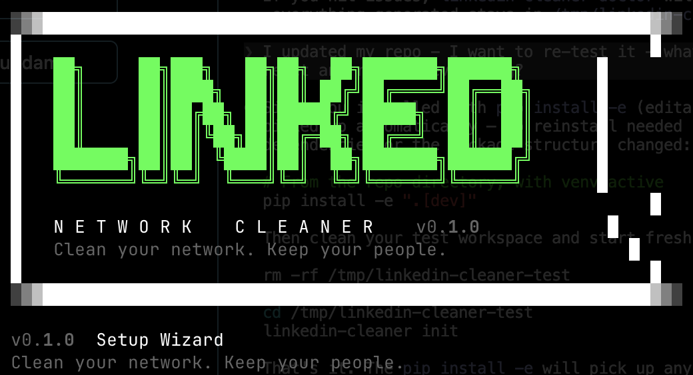
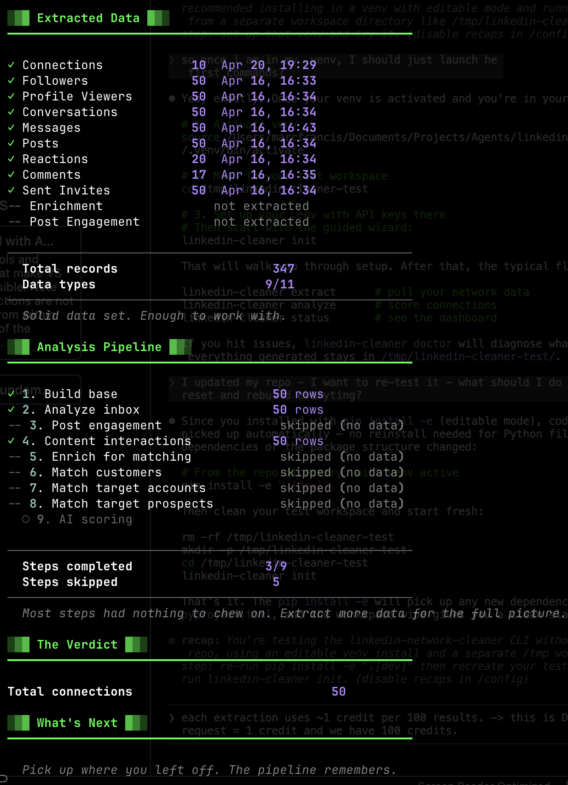
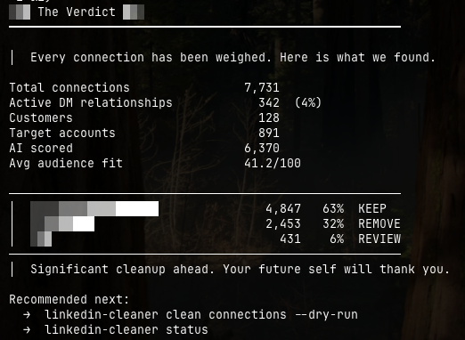
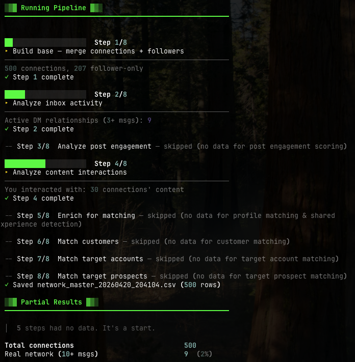

<p align="center">
  
</p>

<p align="center">
  <b>Clean your network. Keep your people.</b><br>
  <sub>Extract, score, and clean your LinkedIn network using AI.</sub>
</p>

---

Your LinkedIn feed sucks — not because of what you post, but because of who's in your network. LinkedIn's algorithm shows your content to your connections first. If half of them are irrelevant, your posts reach the wrong people.

This tool audits every connection, scores them for relevance, and helps you remove the dead weight — so your content reaches the right audience.

---

## What you'll see

<p align="center">
  
  <br><sub>Your full network dashboard — one command, full visibility.</sub>
</p>

<p align="center">
  
  <br><sub>Every connection scored. Color-coded keep/remove decisions.</sub>
</p>

---

## How it works

Three phases. Each one builds on the last.

```
┌──────────┐     ┌──────────┐     ┌──────────┐
│ EXTRACT  │ ──→ │ ANALYZE  │ ──→ │  CLEAN   │
│          │     │          │     │          │
│ Pull your│     │ 9-step   │     │ Preview  │
│ LinkedIn │     │ pipeline │     │ then act │
│ data     │     │ + AI     │     │          │
└──────────┘     └──────────┘     └──────────┘
```

1. **Extract** — Pull your LinkedIn data (connections, messages, post engagement, etc.)
2. **Analyze** — Score every connection with a 9-step pipeline + AI
3. **Clean** — Preview who stays and who goes. You approve every action.

---

## Getting started

### What you'll need

| Requirement | Where to get it | Why |
|---|---|---|
| **Python 3.10+** | [python.org/downloads](https://www.python.org/downloads/) | Runs the tool |
| **Edges API key** | [edges.run](https://edges.run) → sign up → [app.edges.run/settings/developers](https://app.edges.run/settings/developers) | Connects to your LinkedIn data |
| **Anthropic API key** (optional) | [console.anthropic.com](https://console.anthropic.com) | Powers AI scoring (~$0.002/profile) |

### Step 1: Install

One command:

```bash
pip install linkedin-network-cleaner
```

> **Recommended**: Use [pipx](https://pipx.pypa.io/) for a clean, isolated install:
> ```bash
> pipx install linkedin-network-cleaner
> ```
> Don't have pipx? `brew install pipx` (Mac) or `pip install pipx` (anywhere).

Verify it works:

```bash
linkedin-cleaner
```

You should see the banner:

<p align="center">
  
</p>

### Step 2: Set up your workspace

```bash
mkdir my-network && cd my-network
linkedin-cleaner init
```

The setup wizard walks you through everything:

- **Edges API** — paste your API key, select your LinkedIn identity
- **Anthropic API** — optional, skip if you don't have one yet
- **Brand strategy** — tell the AI about your business (or skip and edit later)
- **ICP personas** — define who you want in your network
- **Target lists** — import CSVs of companies and prospects you care about
- **Safelist** — protect family, VIPs, and key partners from ever being removed

<p align="center">
  
</p>

### Step 3: Extract your LinkedIn data

Start with a quick test to make sure everything works:

```bash
linkedin-cleaner extract --connections --limit 100
```

This pulls 100 connections in ~2 minutes. You'll see a live progress bar.

When you're ready for the full extraction:

```bash
linkedin-cleaner extract --all
```

This takes 1.5–2.5 hours depending on your network size. You can interrupt and resume anytime with `--resume`.

> **Edges API credits**: Each extraction uses ~1 credit per API page. Trial accounts start with 100 credits. A full extraction of a 10,000-connection network uses ~250 credits. Check your balance at [app.edges.run](https://app.edges.run).

### Step 4: Analyze your network

```bash
linkedin-cleaner analyze
```

The tool asks you to review your keep signals before running:
- **DM threshold** — how many messages = an active relationship? (default: 5)
- **Engagement signals** — keep people who liked your posts? Commented? You can toggle each one.

Then it runs the 9-step pipeline:

| Step | What it does |
|------|-------------|
| 1 | Build the connection base |
| 2 | Analyze inbox (active DM relationships) |
| 3 | Analyze post engagement (who engages with your content) |
| 4 | Analyze content interactions (whose content you engage with) |
| 5 | Enrich profiles (job titles, skills, experience) |
| 6 | Match against your customer list |
| 7 | Match against target accounts |
| 8 | Match against target prospects |
| 9 | AI scoring — two-tier (Haiku triage → Sonnet deep-score) |

<p align="center">
  
</p>

### Step 5: See the results

```bash
linkedin-cleaner status
```

Your full dashboard — everything in one view.

```bash
linkedin-cleaner clean connections --dry-run
```

Preview every decision before anything happens. Nothing is removed without your explicit approval.

---

## Use with Claude Code (recommended)

Don't want to remember commands? Let Claude Code do the work.

After running `linkedin-cleaner init`, a `CLAUDE.md` is automatically created in your workspace. Just open [Claude Code](https://claude.ai/code) in that directory and talk naturally:

- *"Show me my network status"*
- *"Extract my connections with a limit of 100"*
- *"Analyze my network"*
- *"Help me write my brand strategy"*
- *"Create personas for my ICP — I sell to CTOs at SaaS companies"*
- *"Who should I remove? Show me the worst connections"*

Claude Code reads your data, runs commands, generates missing files (brand strategy, personas, CSVs), and explains everything along the way.

> **Skipped files during init?** No problem. Tell Claude Code *"Help me create my brand strategy"* or *"Generate my persona file"* and it will interview you and write the file in the right format.

---

## The decision cascade

Every connection is evaluated against this priority list. First match wins.

| Priority | Signal | Decision |
|----------|--------|----------|
| 0 | Safelist (family, VIPs) | **KEEP** — always |
| 0b | Custom keep rules (location, company, title) | **KEEP** |
| 1 | Active DM relationship (5+ messages, both replied) | **KEEP** |
| 2 | Customer or former customer | **KEEP** |
| 3 | Target account or prospect | **KEEP** |
| 4 | Engaged with your posts (likers, commenters, reposters) | **KEEP** |
| 5 | You engaged with their content | **KEEP** |
| 6 | Shared school or work experience | **KEEP** |
| 7 | AI audience fit ≥ 50/100 | **KEEP** |
| 8 | Two-way messages (below DM threshold) | **REVIEW** |
| 9 | Everything else | **REMOVE** |

Every signal is configurable. You can disable likers, change the DM threshold, or set a stricter AI cutoff.

---

## Configuration

All settings live in `linkedin-cleaner.toml` in your workspace:

```toml
[extract]
delay = 1.5                    # Seconds between API calls

[analyze]
dm_threshold = 5               # Min total DMs for active relationship
keep_likers = true             # Keep people who liked your posts
keep_commenters = true         # Keep people who commented on your posts
keep_reposters = true          # Keep people who reposted your content
keep_content_interactions = true # Keep people whose content you engaged with
ai_batch_size = 20             # Profiles per AI API call

[clean]
ai_threshold = 50              # Minimum AI score to keep (0-100)
stale_days = 21                # Days before a pending invite is "stale"
batch_size = 25                # Maximum actions per run
delay = 5                      # Seconds between cleanup actions

[safelist]
profiles = []                  # LinkedIn URLs that are NEVER removed

[keep_rules]
keep_locations = []            # e.g., ["paris", "new york"]
keep_companies = []            # e.g., ["google", "anthropic"]
keep_title_keywords = []       # e.g., ["ceo", "founder"]
```

---

## All commands

| Command | What it does |
|---------|-------------|
| `linkedin-cleaner init` | Set up credentials, brand strategy, personas, target lists |
| `linkedin-cleaner extract` | Pull LinkedIn data (connections, messages, engagement...) |
| `linkedin-cleaner analyze` | Run the 9-step scoring pipeline |
| `linkedin-cleaner clean connections` | Preview and execute connection cleanup |
| `linkedin-cleaner clean invites` | Preview and execute invite withdrawal |
| `linkedin-cleaner clean unfollow` | Unfollow low-fit profiles |
| `linkedin-cleaner status` | Full network dashboard |
| `linkedin-cleaner doctor` | Check your setup |

Every command supports `--help` for detailed options.

---

## Cost

| Component | Cost | Notes |
|-----------|------|-------|
| Edges API | ~$3 for a 10K network | [Pricing at edges.run](https://edges.run) |
| Anthropic AI scoring | ~$15-20 for 10K profiles | Optional. Steps 1-8 work without it |
| Your time | ~30 min active, ~2 hours waiting | Most time is extraction (runs in background) |

---

## Safety

- **Dry-run by default** — nothing happens without `--execute`
- **Every action is logged** — full audit trail in `logs/`
- **Data snapshots before changes** — rollback capability
- **Safelist** — protected profiles are never touched
- **Batch limits** — max 25 actions per run by default

---

## FAQ

**Q: Will this get my LinkedIn account restricted?**
A: The tool uses the [Edges API](https://edges.run) which manages rate limits and session safety. It respects LinkedIn's daily limits and stops automatically when they're reached.

**Q: Can I undo a removal?**
A: Connection removals can't be undone (LinkedIn doesn't support it), which is why dry-run is the default. Every removal is logged with full profile data in `logs/data/` so you have a record.

**Q: Do I need the Anthropic API key?**
A: No. Steps 1-8 work without it. AI scoring (step 9) adds a 0-100 audience fit score using Claude, but the tool makes good decisions with just engagement data, target lists, and customer matching.

**Q: How much data does extraction use?**
A: About 1 Edges API credit per page (~40-100 results depending on the endpoint). A full extraction of a 10K network uses ~250 credits. Trial accounts get 100 credits — enough for a test run with `--limit 100`.

---

<p align="center">
  <sub>Built by <a href="https://linkedin.com/in/thefrancis">Marc Francis</a> — because your network should work for you, not against you.</sub>
</p>
