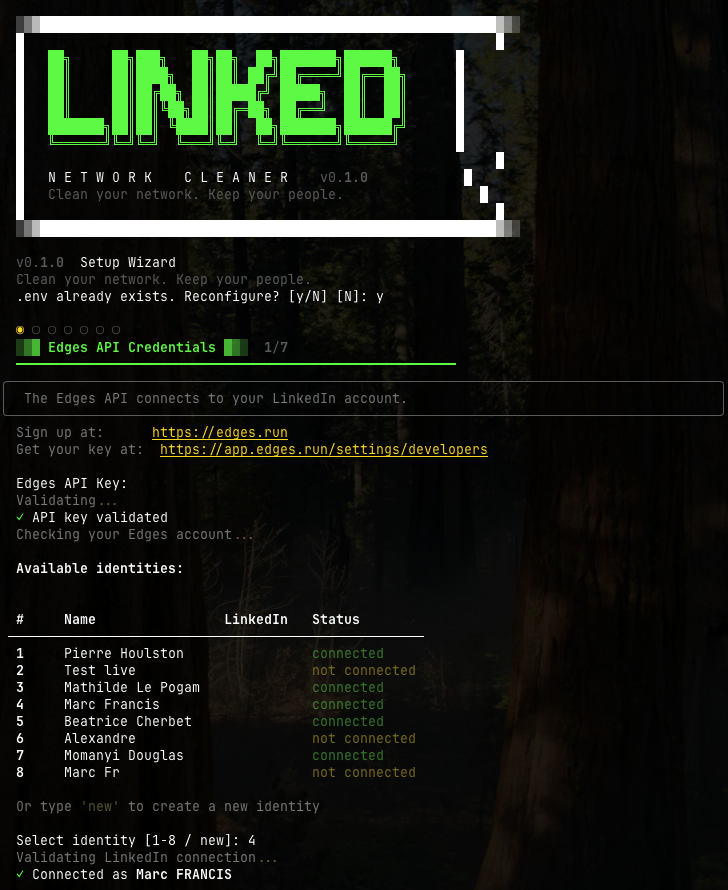
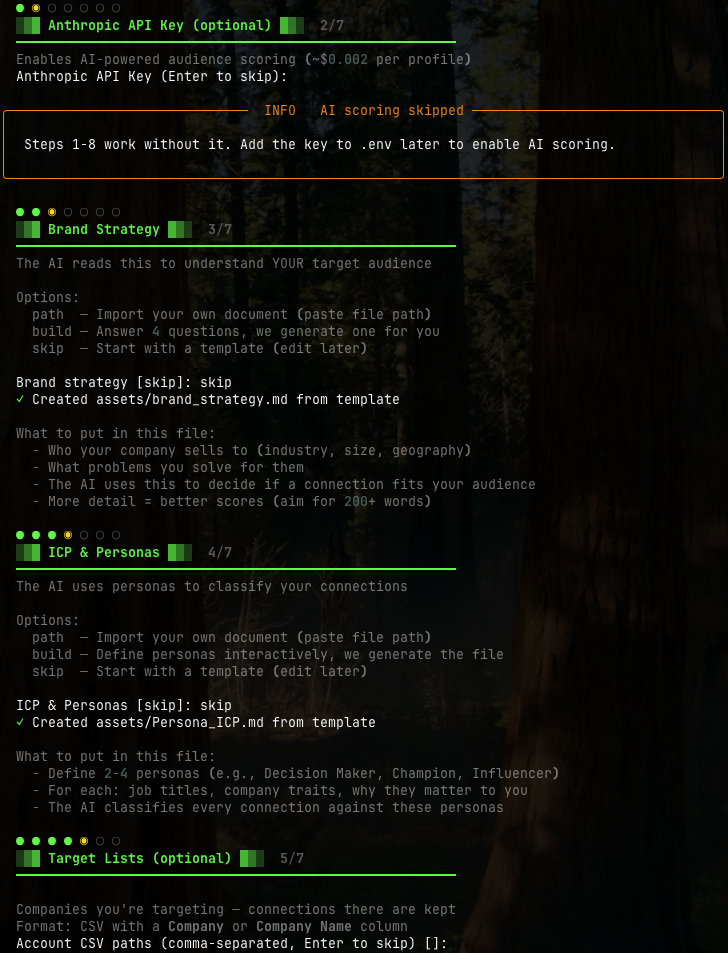
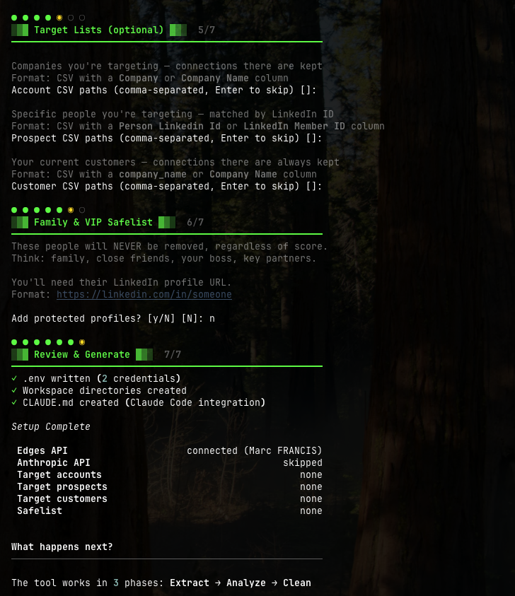
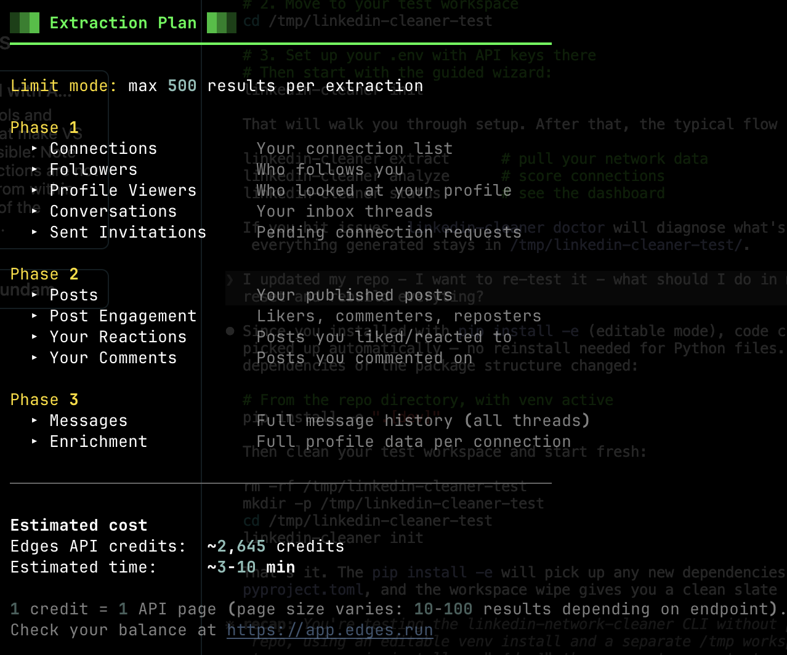
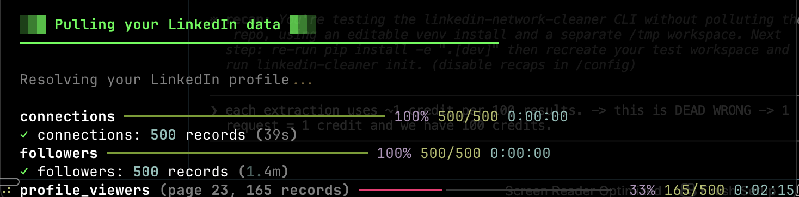
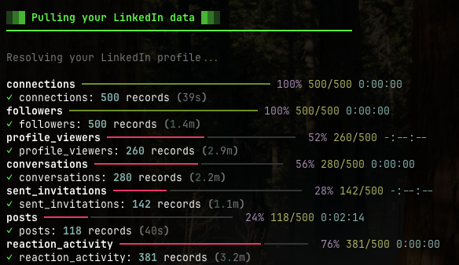

<p align="center">
  
</p>

<p align="center">
  <b>Clean your network. Keep your people.</b><br>
  <sub>Stop posting more. Start cleaning smarter.</sub>
</p>

---

Your LinkedIn feed is broken — not because of what you post, but because of who sees it. LinkedIn's algorithm shows your content to your connections first. If half of them are irrelevant, your reach is wasted on the wrong people.

This tool audits every connection in your network, scores them for relevance, and helps you remove the dead weight — so LinkedIn's algorithm actually works for you.

---

## What you'll see

<p align="center">
  
  <br><sub>Your full network dashboard — one command, full visibility.</sub>
</p>

<p align="center">
  
  <br><sub>Every connection scored. Color-coded keep/remove/review decisions.</sub>
</p>

---

## How it works

```
┌──────────┐     ┌──────────┐     ┌──────────┐
│ EXTRACT  │ ──→ │ ANALYZE  │ ──→ │  CLEAN   │
│          │     │          │     │          │
│ Pull your│     │ 9-step   │     │ Preview  │
│ LinkedIn │     │ scoring  │     │ then act │
│ data     │     │ pipeline │     │          │
└──────────┘     └──────────┘     └──────────┘
```

1. **Extract** — Pull your LinkedIn data: connections, messages, post engagement, who liked your content, who you interacted with
2. **Analyze** — Score every connection through a 9-step pipeline. Optionally add AI scoring for deeper audience fit analysis
3. **Clean** — Preview who stays and who goes. You approve every action. Nothing happens without your say-so

---

## Install

```bash
pip install linkedin-network-cleaner
```

That's it. One command.

> **Prefer isolation?** Use [pipx](https://pipx.pypa.io/) instead:
> ```bash
> pipx install linkedin-network-cleaner
> ```
> Don't have pipx? `brew install pipx` (Mac) or `pip install pipx`.

> **Don't have Python?** Download it at [python.org/downloads](https://www.python.org/downloads/). Get version 3.10 or newer. After installing, the `pip` command will be available in your terminal.

---

## Getting started

### 1. Set up your workspace

```bash
mkdir my-network && cd my-network
linkedin-cleaner init
```

The setup wizard handles everything — API credentials, brand strategy, personas, target lists, and safelist. Each step guides you with explanations and options.

<p align="center">
  
  <br><sub>Step 1: Connect your Edges API and select your LinkedIn identity.</sub>
</p>

<p align="center">
  
  <br><sub>Steps 2-4: Set up AI scoring, brand strategy, and ICP personas.</sub>
</p>

<p align="center">
  
  <br><sub>Steps 5-7: Import target lists, set up your safelist, and generate config.</sub>
</p>

### 2. Extract your data

Start with a quick test:

```bash
linkedin-cleaner extract --connections --limit 100
```

100 connections in ~2 minutes. When you're ready:

```bash
linkedin-cleaner extract --all
```

The tool shows you an extraction plan with credit estimates before starting, then displays live progress bars as data comes in.

<p align="center">
  
  <br><sub>The extraction plan — credit estimate, time estimate, what you'll get.</sub>
</p>

<p align="center">
  
  <br><sub>Live progress bars as your data is pulled.</sub>
</p>

<p align="center">
  
  <br><sub>Extraction complete — all data types extracted with record counts.</sub>
</p>

Full extraction takes 1.5–2.5 hours for a large network. You can interrupt and resume anytime with `--resume`.

> **Edges API credits**: Each extraction uses ~1 credit per API page. Trial accounts start with 100 credits. A full extraction of a 10K network uses ~250 credits. Check your balance at [app.edges.run](https://app.edges.run).

### 3. Analyze your network

```bash
linkedin-cleaner analyze
```

Before running, you'll review your keep signals — DM threshold, engagement toggles — so the analysis matches your definition of a valuable connection.

<p align="center">
  
  <br><sub>The 9-step pipeline scoring every connection.</sub>
</p>

### 4. See the results

```bash
linkedin-cleaner status
```

Your full dashboard — configuration, extracted data, pipeline progress, and the verdict.

```bash
linkedin-cleaner clean connections --dry-run
```

Preview every decision before anything happens. Nothing is removed without your explicit approval.

---

## Use with Claude Code

Don't want to remember commands? Let [Claude Code](https://claude.ai/code) do the work.

After running `linkedin-cleaner init`, a `CLAUDE.md` is automatically created in your workspace. Open Claude Code in that directory and talk naturally:

- *"Show me my network status"*
- *"Extract my connections with a limit of 100"*
- *"Analyze my network"*
- *"Help me write my brand strategy"*
- *"Create personas for my ICP — I sell to CTOs at SaaS companies"*
- *"Who should I remove? Show me the worst connections"*

Claude Code reads your data, runs commands, generates missing files, and explains results.

> **Skipped files during init?** Tell Claude *"Help me create my brand strategy"* and it will interview you and write the file in the right format.

---

## How decisions are made

Every connection is evaluated against this priority list. First match wins.

| Priority | Signal | Decision |
|----------|--------|----------|
| 0 | Safelist (family, VIPs) | **KEEP** |
| 1 | Active DM relationship (5+ messages, both replied) | **KEEP** |
| 2 | Customer or former customer | **KEEP** |
| 3 | Target account or prospect | **KEEP** |
| 4 | Engaged with your posts (likes, comments, reposts) | **KEEP** |
| 5 | You engaged with their content | **KEEP** |
| 6 | Shared school or work experience | **KEEP** |
| 7 | AI audience fit above threshold | **KEEP** |
| 8 | Some messages but below threshold | **REVIEW** |
| 9 | No signals | **REMOVE** |

Every signal is configurable in `linkedin-cleaner.toml`.

---

## Configuration

All settings live in `linkedin-cleaner.toml`:

```toml
[analyze]
dm_threshold = 5               # Min total DMs for active relationship
keep_likers = true             # Keep people who liked your posts
keep_commenters = true         # Keep people who commented
keep_reposters = true          # Keep people who reposted
keep_content_interactions = true # Keep people whose content you engaged with

[clean]
ai_threshold = 50              # Min AI score to keep (0-100)
batch_size = 25                # Max actions per run

[safelist]
profiles = []                  # LinkedIn URLs that are NEVER removed

[keep_rules]
keep_locations = []            # e.g., ["paris", "new york"]
keep_companies = []            # e.g., ["google", "anthropic"]
keep_title_keywords = []       # e.g., ["ceo", "founder"]
```

---

## Commands

| Command | What it does |
|---------|-------------|
| `linkedin-cleaner init` | Set up credentials and workspace |
| `linkedin-cleaner extract` | Pull LinkedIn data |
| `linkedin-cleaner analyze` | Score every connection |
| `linkedin-cleaner clean connections` | Preview and execute connection cleanup |
| `linkedin-cleaner clean invites` | Manage sent invitations |
| `linkedin-cleaner clean unfollow` | Unfollow low-fit profiles |
| `linkedin-cleaner status` | Full network dashboard |
| `linkedin-cleaner doctor` | Check your setup |

Every command supports `--help`.

---

## Cost

| What | Cost | Notes |
|------|------|-------|
| Edges API | ~$3 for 10K connections | [edges.run](https://edges.run) |
| AI scoring | ~$15-20 for 10K profiles | Optional. Works without it |
| Your time | ~30 min active | Extraction runs in background |

---

## Safety

- **Dry-run by default** — nothing executes without `--execute`
- **Full audit trail** — every action logged
- **Data snapshots** — rollback capability for every change
- **Safelist** — protected profiles are never touched
- **Batch limits** — 25 actions per run maximum

---

## FAQ

**Will this get my LinkedIn account restricted?**<br>
The tool uses the [Edges API](https://edges.run) which manages rate limits and session safety. It stops automatically when LinkedIn's daily limits are reached.

**Can I undo a removal?**<br>
Connection removals can't be undone by LinkedIn. That's why dry-run is the default. Every removal is logged with full profile data in `logs/data/`.

**Do I need the AI scoring?**<br>
No. Steps 1-8 work without it and make good decisions using engagement data, target lists, and customer matching. AI scoring adds a 0-100 audience fit score for deeper analysis.

**How many Edges credits do I need?**<br>
~1 credit per API page. A full 10K-connection extraction uses ~250 credits. Trial accounts get 100 credits — enough for `--limit 100` testing.

---

<p align="center">
  <sub>Built by <a href="https://linkedin.com/in/thefrancis">Marc Francis</a></sub>
</p>
